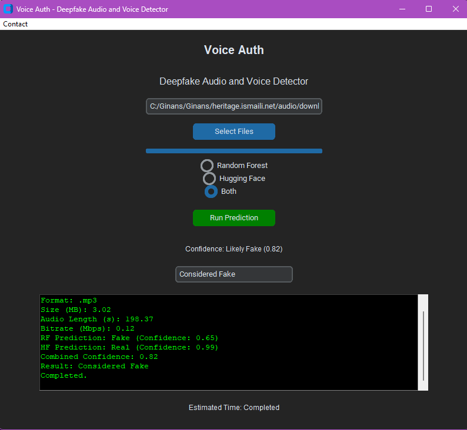

# Voice Auth: Deepfake Audio and Voice Detector

## Overview

Voice Auth is an audio deepfake detection application designed to identify manipulated audio content. Utilizing advanced
machine learning models, the application processes audio files and provides insights into their authenticity. It
supports various audio and video formats, converts them to WAV, and extracts features for analysis. The application has a built-in database and works on Windows.

## Features

- **Deepfake Detection**: Uses both a Random Forest model and a Hugging Face pipeline model for accurate predictions.
- **File Format Support**: Handles multiple audio formats (e.g., MP3, WAV, FLAC) and video formats (e.g., MP4, AVI) by
  converting them to WAV.
- **MFCC Visualization**: Visualizes Mel-Frequency Cepstral Coefficients (MFCC) features extracted from audio files.
- **Metadata Storage**: Logs file metadata, including format, size, audio length, and prediction results in a SQLite
  database.
- **User-Friendly Interface**: Built with `customtkinter`, providing a modern and intuitive user experience.
- **Batch Processing**: Allows users to upload and process multiple files simultaneously.
- **Logging with Typewriter Effect**: Displays logs with a typewriter effect for better readability.



## Installation

1. Clone this repository:
   ```bash
   git clone https://github.com/sadiqkassamali/voice-auth.git
   cd voice-auth
